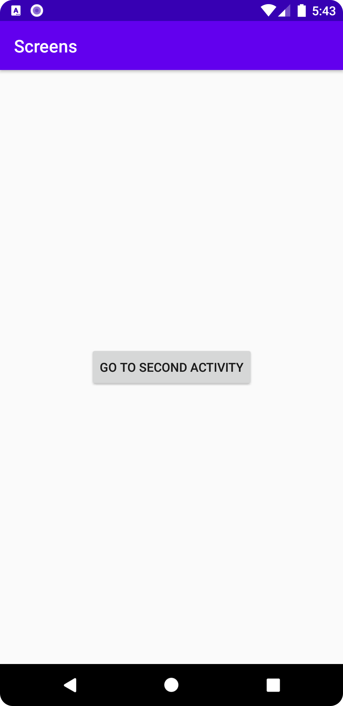
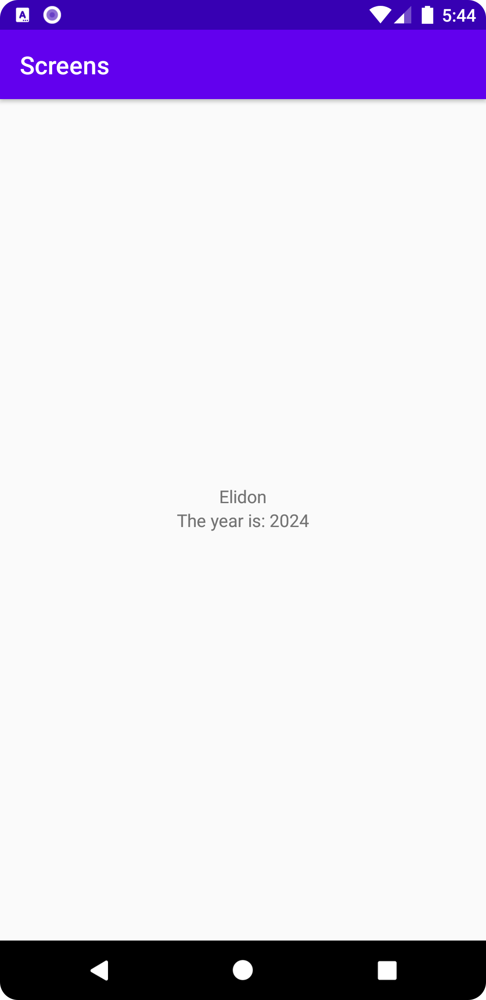

# Rapport

Lagt till en ny empty activity och knapp
som byter activity (med Intent) + lagt till
data som skickas i Intent (med putExtra) till
Bundle extra och används i widgets

```
//MainActivity
ENDAST RELEVANT KOD VISAS
    protected void onCreate(Bundle savedInstanceState) {
        goToSecondActivity();
    }

    private void goToSecondActivity() {
        Button btn = (Button) findViewById(R.id.button);
        btn.setOnClickListener(new View.OnClickListener() {
            @Override
            public void onClick(View view) {
                Intent intent = new Intent(MainActivity.this, SecondActivity.class);
                intent.putExtra("name", "Elidon");
                intent.putExtra("number", 2024);
                startActivity(intent);
            }
        });
    }
```

```
//SecondActivity
ENDAST RELEVANT KOD VISAS
    
    Bundle extras = getIntent().getExtras();
    if (extras != null) {
        String name = extras.getString("name");
        int number = extras.getInt("number");

        TextView textView1 = findViewById(R.id.textView1);
        TextView textView2 = findViewById(R.id.textView2);

        textView1.setText(name);
        textView2.setText("The year is: "+ number);
    }

```

Bilder

MainActivity img:


SecondActivity img:

